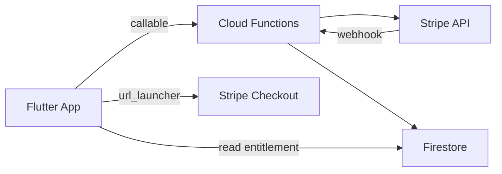

# Assinatura Stripe (Plano Pro)

## Resumo

Monetização do **Clientta Pro** via **assinatura mensal Stripe**. O app Flutter **não** inclui Stripe SDK — toda interação sensível ocorre em **Cloud Functions** (callables) e **Stripe Checkout** (URL aberta com `url_launcher`).

Padrão alinhado ao projeto **agendamentos** (callables + webhook + Firestore entitlement).

## Plano

**Pro** — sync na nuvem e limites removidos.

## Arquitetura



## Cloud Functions (callables)

| Callable | Responsabilidade |
|----------|------------------|
| `getPlanPricing` | Retorna preço, moeda, `priceId` do plano Pro (sandbox ou live) |
| `createSubscription` | Cria sessão Checkout ou Subscription; retorna `checkoutUrl` |
| `syncSubscriptionStatus` | Consulta Stripe e atualiza Firestore (refresh manual na tela de plano) |
| `cancelSubscription` | Cancela assinatura no fim do período ou imediato (política de produto) |
| `cancelInactiveSubscriptions` | **Agendada** — cancela assinaturas Pro sem atividade por 2 meses |
| `trackUserActivityOnAppointmentWrite` | **Trigger Firestore** — atualiza `lastActivityAt` em escritas na subcoleção `appointments` |
| `stripeBillingWebhook` | **HTTP** (não callable) — eventos Stripe |

### Eventos webhook relevantes

- `checkout.session.completed`
- `customer.subscription.created` / `updated` / `deleted`
- `invoice.payment_failed`

Webhook atualiza `users/{uid}.subscription`:

```json
{
  "status": "active | past_due | canceled | trialing",
  "stripeCustomerId": "cus_...",
  "stripeSubscriptionId": "sub_...",
  "priceId": "price_...",
  "currentPeriodEnd": "Timestamp",
  "cancelAtPeriodEnd": false
}
```

### Política de inatividade (2 meses)

Assinaturas Pro **ativas** sem uso por **2 meses** são canceladas automaticamente ao fim do período já pago.

→ Detalhes: [politica-assinatura.md](../legal/politica-assinatura.md) (usuário) · [billing/readme.md](../billing/readme.md) §7 (operacional)

## App Flutter

| Aspecto | Implementação |
|---------|---------------|
| SDK Stripe | **Não usar** |
| Checkout | `url_launcher` abre `checkoutUrl` retornada por `createSubscription` |
| Entitlement | Stream ou one-shot read de `users/{uid}.subscription` |
| Tela | `/configuracoes/plano` — status, CTA assinar, cancelar, sync status |
| Free gates | Sync, limites de agenda e lembretes checam entitlement ativo |

## Sandbox

- Chaves de teste (`sk_test_...`, `whsec_test_...`) em secrets de Functions.
- Cartões de teste Stripe (ex.: `4242 4242 4242 4242`).
- App em debug pode exibir badge “Sandbox” quando `priceId` de teste.

## Status

**Implementado** — Fase 3 do [PLANEJAMENTO.md](../PLANEJAMENTO.md).

## Dependências técnicas

- `firebase_functions`, `cloud_firestore`, `url_launcher`
- Secrets: ver [billing/readme.md](../billing/readme.md)
- Não commitar chaves no repositório

## Documentação relacionada

- [billing/readme.md](../billing/readme.md) — setup operacional
- [legal/politica-assinatura.md](../legal/politica-assinatura.md) — cancelamento por inatividade
- [sincronizacao_nuvem.md](sincronizacao_nuvem.md) — feature gated por Pro
- [README.md](README.md) — comparativo Free/Pro
