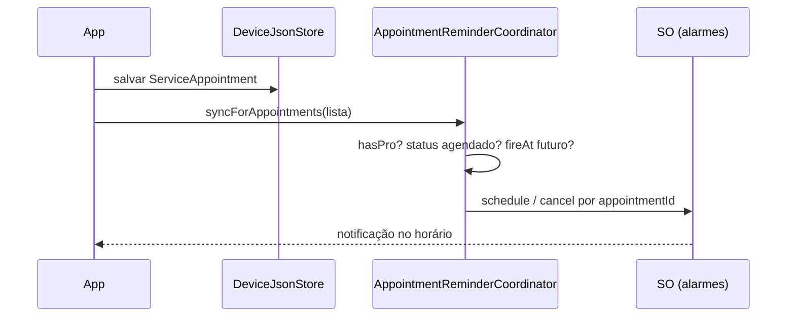

# Lembretes locais — atendimento próximo

## Resumo

Notificações **locais** no dispositivo para avisar o profissional quando um atendimento **agendado** está se aproximando (ex.: 15 minutos antes de `startTime`).  
Recurso do tier **Pro** — sem servidor, sem push remoto, alinhado ao offline-first.

**Status:** implementado (v1) — UI Pro, deep link e sync; polish opcional pendente.

---

## Validação de viabilidade

| Critério | Avaliação |
|----------|-----------|
| Caso de uso (“atendimento em X min”) | **Válido** — `zonedSchedule` com `timezone` resolve data/hora local |
| Offline-first | **Válido** — agenda em `clientta_data.json`; OS dispara sem rede |
| Gate Pro | **Válido** — `PlanAccessPolicy.canScheduleLocalReminders` |
| Android (API 24+) | **Válido** com ressalvas — permissão `POST_NOTIFICATIONS` (API 33+); alarmes exatos exigem UX extra (API 31+) |
| iOS | **Válido** — prompt de permissão no primeiro uso; notificações locais sem APNs |
| Séries recorrentes | **Válido** — um alarme por `ServiceAppointment.id` |
| Cancelamento / edição | **Válido** — reagendar ou cancelar por `notificationId` derivado do `id` |
| Sync Firestore | **Independente** — lembretes são locais; mudança de aparelho não replica alarmes (aceitável para v1) |

### Veredicto

**Implementação recomendada** com `flutter_local_notifications` + `timezone`.  
Não substitui push na nuvem; é benefício Pro de produtividade no mesmo aparelho onde a agenda já vive.

### Limitações conhecidas (documentar na UI)

1. **Android — economia de bateria / Doze:** alarmes *inexatos* podem atrasar alguns minutos; modo exato pede permissão “Alarmes e lembretes”.
2. **Force-stop:** se o usuário forçar parada do app, alarmes podem não disparar até reabrir o Clientta.
3. **Reboot:** v1 re-sincroniza alarmes ao abrir o app (home); boot receiver opcional em fase posterior.
4. **Fuso horário:** recalcular ao mudar timezone do dispositivo (sync no `load` da home).
5. **Multi-dispositivo:** lembrete no celular A não aparece no celular B (diferente do sync Pro).

---

## Plano

| Recurso | Free | Pro |
|---------|------|-----|
| Lembrete antes do atendimento | — | Sim |
| Configurar antecedência (15 / 30 / 60 min) | — | Sim (`/plano`) |
| Desligar lembretes | — | Sim (`/plano` e formulário) |

Free: nenhum alarme é agendado; tentativa exibe CTA para `/plano`.

---

## Comportamento desejado



| Regra | Detalhe |
|-------|---------|
| Elegível | `status == agendado` |
| Horário | `appointmentDate` + `startTime` − `leadMinutes` (padrão **15**) |
| Passado | Não agenda |
| Concluído / cancelado | Cancela alarme |
| Edição | Cancela + reagenda se ainda elegível |
| Exclusão | Cancela alarme |
| ID da notificação | `appointmentId.hashCode` (estável por atendimento) |

### Payload da notificação

- **Título:** “Atendimento em breve”
- **Corpo:** `{clientName} · {serviceType} às {startTime}`

Toque abre o app na home ou no atendimento (deep link — fase UI).

---

## Arquitetura (Flutter)

```
lib/features/appointments/
  domain/reminders/
    appointment_reminder_settings.dart   # leadMinutes, enabled
    appointment_reminder_policy.dart     # fireAt, notificationId, elegibilidade
    appointment_reminder_scheduler.dart  # contrato (schedule/cancel/sync)
  data/
    local_appointment_reminder_scheduler.dart  # flutter_local_notifications
    appointment_reminder_coordinator.dart      # Pro gate + orquestração
lib/core/notifications/
  local_notifications_bootstrap.dart   # init plugin + timezone
```

Persistência de preferências: `profile.appointmentReminders` em `clientta_data.json` via `AppProfileSettings`.

Integração:

- `AppointmentReminderCoordinator.syncForAppointments` chamado no `HomeViewModel.load` (Pro).
- Futuro: formulário de agenda (toggle “Lembrar-me”), tela de configurações.

Gate: `PlanAccessPolicy.canScheduleLocalReminders`.

---

## Setup nativo (checklist)

### Android (`AndroidManifest.xml`)

- [x] `POST_NOTIFICATIONS` (API 33+)
- [x] `RECEIVE_BOOT_COMPLETED` (reschedule futuro)
- [x] `SCHEDULE_EXACT_ALARM` / `USE_EXACT_ALARM` (alarmes precisos — opcional v1)
- [x] `WAKE_LOCK` (plugin)
- [ ] Canal `clientta_appointment_reminders` (criado em código)

### iOS (`Info.plist`)

- [ ] `NSUserNotificationsUsageDescription` antes do release iOS
- Permissão solicitada em runtime via plugin

### Dependências Dart

```yaml
flutter_local_notifications: ^19.x
timezone: ^0.10.x
```

---

## Critérios de aceite (C-410)

- [ ] Pro ativo: salvar atendimento `agendado` para daqui 2h agenda notificação ~1h45 depois (lead 15 min).
- [ ] Concluir/cancelar atendimento remove notificação pendente.
- [ ] Free: nenhum alarme após CRUD de agenda.
- [ ] Reabrir app re-sincroniza alarmes com JSON local.
- [ ] `flutter analyze` limpo.
- [ ] Copy e permissões em `daily_strings.dart` / política de privacidade (notificações locais).

---

## Documentação relacionada

- [README.md](README.md) — comparativo Free/Pro
- [assinatura_stripe.md](assinatura_stripe.md) — entitlement Pro
- [agendas.md](agendas.md) — modelo `ServiceAppointment`
- [../tasks/a_fazer/lembretes_locais.md](../tasks/a_fazer/lembretes_locais.md) — backlog C-410
- [../PLANEJAMENTO.md](../PLANEJAMENTO.md) — fase 4.3
