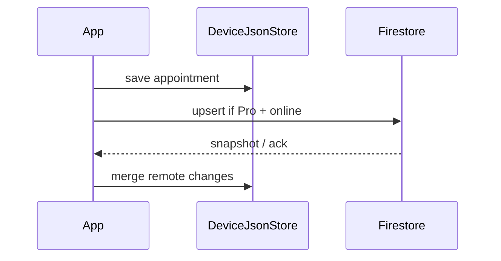

# Sincronização na nuvem

## Resumo

Sincronização **bidirecional** entre `DeviceJsonStore` (local) e **Firestore** após login Firebase. Feature do tier **Pro** — requer entitlement ativo em `users/{uid}.subscription`.

## Plano

**Pro**

### Free

- Apenas dados no aparelho; sem sync automático.
- Login pode existir para preparar upgrade Pro.

### Pro

- Upload e download de `ServiceAppointment` sob `users/{uid}/appointments/{appointmentId}`.
- Resolução de conflitos: **última escrita vence** por `updatedAt` (timestamp server ou client).
- Sync em background ao abrir app e após cada save local (debounce).
- Indicador na UI: última sync, fila pendente, erro de rede.

## Fluxo



## Estrutura Firestore (sugerida)

```
users/{uid}
  subscription: { status, stripeCustomerId, currentPeriodEnd, ... }
  appointments/{appointmentId}
    clientName, clientPhone, serviceType, ...
    updatedAt, userId
```

## Regras de segurança

- `request.auth != null`
- `request.auth.uid == uid` no path `users/{uid}/**`
- Cliente Flutter **nunca** escreve em `subscription` diretamente — apenas Functions/webhook Stripe.

## Status no app

**Planejado** — Fase 2 do [PLANEJAMENTO.md](../PLANEJAMENTO.md).

## Dependências técnicas

- Firebase Auth (uid)
- `cloud_firestore`, `firebase_auth`
- `ServiceAppointmentRepositoryRemote` + orquestrador de sync no ViewModel ou serviço dedicado
- Gate: ler `users/{uid}.subscription.status == active` antes de sync
- Offline: fila local de operações pendentes (opcional MVP+: `syncQueue` no JSON local)

## Documentação relacionada

- [assinatura_stripe.md](assinatura_stripe.md) — entitlement Pro
- [guia_clientta.md](../guia_clientta.md) — setup Firebase
