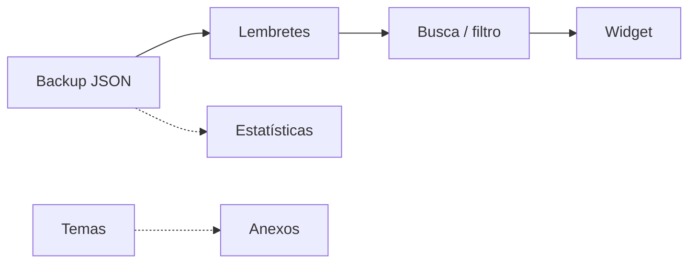

# Mapeamento de tarefas — Sextante

Índice de trabalho possível para o **Sextante** (`university_hub`), com **o que fazer**, **objetivo** e **impacto** por item.  
Complementa [PLANEJAMENTO.md](PLANEJAMENTO.md) (fases) e [features/README.md](features/README.md) (catálogo Free/Pro).

**Produto:** nome de exibição **Sextante** (`AppMission.name` em `lib/core/strings/app_mission.dart`).  
**Monetização:** paywall e billing **não** estão no app; itens Pro são roadmap de produto.

## Como ler a tabela

| Campo | Descrição |
|-------|-----------|
| **ID** | Identificador curto (ex. T-001) |
| **Área** | produto / engenharia / design / loja / monetização / qualidade |
| **O que fazer** | Ação concreta |
| **Objetivo** | Por que existe |
| **Impacto** | Alto / Médio / Baixo + efeito esperado |
| **Status** | Não iniciado / Em andamento / Concluído / Bloqueado |
| **Relacionado** | Link para feature ou doc |

---

## 1. Já entregue

| ID | Área | O que fazer | Objetivo | Impacto | Status | Relacionado |
|----|------|-------------|----------|---------|--------|-------------|
| T-001 | produto | Manter painel **Início** com aulas e atividades de hoje | Reduzir tempo até o que importa no dia | Alto — retenção e hábito diário | Concluído | [home_hoje.md](features/home_hoje.md) |
| T-002 | produto | Cadastro de **disciplinas** na grade | Base para horário e sala por dia da semana | Alto — núcleo do valor | Concluído | [disciplinas.md](features/disciplinas.md) |
| T-003 | produto | **Grade horária** semanal (dia, horário, sala) | Resolver “onde e quando” é a aula | Alto — retenção | Concluído | [grade_horaria.md](features/grade_horaria.md) |
| T-004 | produto | **Atividades** com tipo, data e marcação de concluída | Centralizar entregas e provas | Alto — retenção | Concluído | [atividades.md](features/atividades.md) |
| T-005 | produto | **Perfil** com nome da universidade (local) | Personalizar sem conta | Médio — identidade e confiança | Concluído | [perfil_universidade.md](features/perfil_universidade.md) |
| T-006 | engenharia | Persistência **offline** em `DeviceJsonStore` (JSON no dispositivo) | Funcionar sem internet após instalar | Alto — proposta do produto | Concluído | [GUIA_UNIVERSITARIO.md](GUIA_UNIVERSITARIO.md) |
| T-007 | engenharia | Arquitetura **MVVM + GetIt** e repositórios locais por feature | Manter evolução previsível | Médio — manutenção | Concluído | [GUIA_UNIVERSITARIO.md](GUIA_UNIVERSITARIO.md) |
| T-008 | design | Identidade **Hub** (`HubTheme`, componentes `Hub*`, verde Sextante) | UI consistente nas telas principais | Médio — confiança e marca | Concluído | [../DESIGN.md](../DESIGN.md) |
| T-009 | produto | **Rebrand** para Sextante (nome, copy, migração de arquivo legado) | Alinhar produto à metáfora e à loja | Médio — go-to-market | Concluído | [PROPOSITO.md](PROPOSITO.md) |
| T-010 | produto | Série de aulas em **vários dias** com exclusão por dia ou série | Atender turmas que repetem na semana | Médio — retenção | Concluído | [design-brief-class-multi-day.md](design-brief-class-multi-day.md) |
| T-011 | produto | Ordenar atividades de hoje (não concluídas primeiro) | Priorizar o que ainda falta fazer | Médio — retenção | Concluído | [home_hoje.md](features/home_hoje.md) |
| T-012 | produto | Diálogo de confirmação ao **excluir** aula (dia ou série) | Evitar perda acidental de dados | Médio — confiança | Concluído | [grade_horaria.md](features/grade_horaria.md) |
| T-013 | engenharia | Remover **Firebase, auth e IAP** do escopo atual | Release limpo e alinhado ao offline-first | Alto — confiança e manutenção | Concluído | [PLANEJAMENTO.md](PLANEJAMENTO.md) |

---

## 2. Próximo trimestre (roadmap Pro e núcleo)

Prioridade sugerida alinhada a [PLANEJAMENTO.md](PLANEJAMENTO.md) Fases 1–2.

| ID | Área | O que fazer | Objetivo | Impacto | Status | Relacionado |
|----|------|-------------|----------|---------|--------|-------------|
| T-101 | produto | **Formulários Hub** completos (observação multilinha, validação de horário) | Menos atrito ao cadastrar | Alto — retenção | Não iniciado | [PLANEJAMENTO.md](PLANEJAMENTO.md) §4 |
| T-102 | produto | Ordenar **aulas de hoje** por `startTime` | Leitura natural da agenda do dia | Médio — retenção | Não iniciado | [home_hoje.md](features/home_hoje.md) |
| T-103 | design | Revisar **empty states** com copy validada (TCC/extensão) | Primeira impressão quando não há dados | Médio — conversão de uso | Não iniciado | [PLANEJAMENTO.md](PLANEJAMENTO.md) §4 |
| T-104 | produto | **Onboarding** leve (1–2 telas: dados no celular + primeira aula) | Ativar usuário na primeira sessão | Alto — retenção | Não iniciado | [PLANEJAMENTO.md](PLANEJAMENTO.md) §4 |
| T-105 | produto | **Busca / filtro** de atividades (tipo ou período) | Encontrar entregas em listas longas | Médio — retenção | Não iniciado | [PLANEJAMENTO.md](PLANEJAMENTO.md) §5 |
| T-106 | produto | **Exportar / importar** backup JSON com share intent e validação | Trocar de aparelho sem perder grade | Alto — conversão Pro futura | Não iniciado | [export_backup.md](features/export_backup.md) |
| T-107 | produto | **Lembretes locais** (`flutter_local_notifications`) | Reduzir esquecimento de prazos | Alto — conversão Pro / retenção | Não iniciado | [lembretes_notificacoes.md](features/lembretes_notificacoes.md) |
| T-108 | produto | **Estatísticas** de conclusão e resumo por período | Feedback de progresso | Médio — conversão Pro | Não iniciado | [estatisticas_progresso.md](features/estatisticas_progresso.md) |
| T-109 | design | **Temas** além do claro padrão (incl. escuro estendido no Pro) | Conforto visual e diferenciação Pro | Médio — conversão Pro | Não iniciado | [temas_personalizados.md](features/temas_personalizados.md) |
| T-110 | produto | **Anexos** por aula/atividade (armazenamento local) | Materiais junto do contexto da aula | Médio — conversão Pro | Não iniciado | [materiais_anexos.md](features/materiais_anexos.md) |
| T-111 | produto | **Widget** Android “próxima aula” (+ iOS se viável) | Valor na tela inicial do SO | Alto — conversão Pro / retenção | Não iniciado | [widgets_tela_inicial.md](features/widgets_tela_inicial.md) |
| T-112 | produto | **Múltiplos semestres** (arquivar períodos) | Histórico sem poluir o período ativo | Médio — conversão Pro | Não iniciado | [multiplos_semestres.md](features/multiplos_semestres.md) |
| T-113 | produto | **Sincronização na nuvem** (somente após decisão explícita) | Backup automático multi-dispositivo | Baixo hoje — contraria offline atual | Bloqueado | [sincronizacao_nuvem.md](features/sincronizacao_nuvem.md) |

### Dependências sugeridas (roadmap Pro)

---

## 3. Fundação técnica

| ID | Área | O que fazer | Objetivo | Impacto | Status | Relacionado |
|----|------|-------------|----------|---------|--------|-------------|
| T-201 | qualidade | Manter **`flutter analyze`** sem erros no `main` | Evitar regressões em release | Alto — manutenção | Em andamento | [PLANEJAMENTO.md](PLANEJAMENTO.md) §3 |
| T-202 | qualidade | Expandir **testes de domínio** (ViewModels home, grade, atividades com `mocktail`) | Refatorar com segurança | Médio — manutenção | Não iniciado | [PLANEJAMENTO.md](PLANEJAMENTO.md) §4 |
| T-203 | qualidade | **Restaurar / alinhar** `integration_test/` ao fluxo Hub atual | CI e regressão de navegação | Alto — manutenção | Não iniciado | [PLANEJAMENTO.md](PLANEJAMENTO.md) §6 |
| T-204 | qualidade | Testes **Patrol** ou em dispositivo (drawer, FAB) | Cobrir gestos difíceis em widget test | Médio — manutenção | Não iniciado | [PLANEJAMENTO.md](PLANEJAMENTO.md) §6 |
| T-205 | engenharia | **Build release** Android (`appbundle`) com `versionCode` incremental | Publicar na Play Store | Alto — distribuição | Em andamento | [PLANEJAMENTO.md](PLANEJAMENTO.md) §3 |
| T-206 | engenharia | Auditar **AndroidManifest** (permissões de mídia não usadas) | Conformidade e revisão da loja | Médio — confiança | Não iniciado | [PLANEJAMENTO.md](PLANEJAMENTO.md) §3 |
| T-207 | engenharia | **Codemagic**: analyze + bundle sem secrets Firebase | Pipeline confiável | Alto — manutenção | Em andamento | [GUIA_UNIVERSITARIO.md](GUIA_UNIVERSITARIO.md) |
| T-208 | engenharia | Migrar `DropdownButtonFormField` deprecado para **`initialValue`** | Compatibilidade com SDK Flutter | Baixo — manutenção | Não iniciado | [PLANEJAMENTO.md](PLANEJAMENTO.md) §8 |
| T-209 | engenharia | Declarar ou remover uso de **`url_launcher`** | `depend_on_referenced_packages` limpo | Baixo — manutenção | Não iniciado | [PLANEJAMENTO.md](PLANEJAMENTO.md) §8 |
| T-210 | engenharia | Acompanhar compatibilidade do **`design_system`** (Git) com o SDK | Evitar quebra de build | Médio — manutenção | Em andamento | [GUIA_UNIVERSITARIO.md](GUIA_UNIVERSITARIO.md) |
| T-211 | engenharia | Atualizar **remote** e links do repositório canonical | Onboarding de contribuidores e CI | Baixo — manutenção | Não iniciado | [PLANEJAMENTO.md](PLANEJAMENTO.md) §3 |
| T-212 | qualidade | **Internacionalização** (opcional; hoje PT em `strings.dart`) | Ampliar mercado | Baixo — conversão | Não iniciado | [PLANEJAMENTO.md](PLANEJAMENTO.md) §6 |

---

## 4. Go-to-market

| ID | Área | O que fazer | Objetivo | Impacto | Status | Relacionado |
|----|------|-------------|----------|---------|--------|-------------|
| T-301 | loja | Manter **listing** Play (nome, descrições, versão) alinhado ao app | ASO e clareza na instalação | Alto — aquisição | Em andamento | [stores/LISTING.md](stores/LISTING.md) |
| T-302 | loja | Atualizar **screenshots** e ordem na galeria | Mostrar painel do dia e grade | Alto — conversão na loja | Em andamento | [stores/prints/README.md](stores/prints/README.md) |
| T-303 | loja | **Política de privacidade** refletindo só armazenamento local | Aprovação na Play Console | Alto — confiança | Não iniciado | [PLANEJAMENTO.md](PLANEJAMENTO.md) §6 |
| T-304 | loja | Materiais de campanha Play ([CAMPANHA-PLAY](stores/CAMPANHA-PLAY.md), entrega) | Lançamento coordenado | Médio — aquisição | Em andamento | [stores/ENTREGA-PLAY.md](stores/ENTREGA-PLAY.md) |
| T-305 | loja | **TestFlight** / App Store (quando iOS estiver no escopo) | Segundo canal de distribuição | Médio — aquisição | Não iniciado | [PLANEJAMENTO.md](PLANEJAMENTO.md) §3 |
| T-306 | loja | Publicação **LinkedIn** e copy de lançamento | Alcance orgânico inicial | Baixo — aquisição | Em andamento | [stores/LINKEDIN-PUBLICACAO.md](stores/LINKEDIN-PUBLICACAO.md) |
| T-307 | design | Feature graphic e ícone consistentes com **Sextante** | Reconhecimento na loja | Médio — conversão na loja | Em andamento | [stores/store-assets/](stores/store-assets/) |

---

## 5. Monetização (design e decisão — sem billing no código hoje)

| ID | Área | O que fazer | Objetivo | Impacto | Status | Relacionado |
|----|------|-------------|----------|---------|--------|-------------|
| T-401 | monetização | Documentar **limites Free** vs **benefícios Pro** (volume, features) | Base para paywall futuro | Médio — conversão Pro | Concluído | [features/README.md](features/README.md) |
| T-402 | monetização | Definir **preço e periodicidade** (mensal/anual) e experimento | Viabilidade econômica | Alto — receita | Não iniciado | [PRODUCT.md](../PRODUCT.md) |
| T-403 | design | Esboçar **paywall** e pontos de upgrade (backup, lembretes, stats) | UX clara sem frustrar o Free | Alto — conversão Pro | Não iniciado | [export_backup.md](features/export_backup.md) |
| T-404 | monetização | Plano técnico **Google Play Billing 8+** (quando reintroduzir) | Cobrança conforme políticas | Alto — receita | Bloqueado | [PLANEJAMENTO.md](PLANEJAMENTO.md) §7 |
| T-405 | monetização | Avaliar **anúncios** vs assinatura (hoje desligados) | Monetização sem degradar offline | Baixo — decisão futura | Bloqueado | [PLANEJAMENTO.md](PLANEJAMENTO.md) §7 |
| T-406 | produto | Implementar **enforcement** de limites Free no app | Diferenciar tiers de fato | Alto — conversão Pro | Não iniciado | [features/README.md](features/README.md) |

---

## Resumo por status

| Status | Quantidade (IDs) |
|--------|------------------|
| Concluído | 14 (T-001–T-013, T-401) |
| Em andamento | 9 (T-201, T-205, T-207, T-210, T-301, T-302, T-304, T-306, T-307) — *ajustar conforme sprint* |
| Não iniciado | 25 |
| Bloqueado | 3 (T-113, T-404, T-405) |

**Total de tarefas listadas:** 51

---

## Manutenção deste documento

- Ao concluir entrega: atualizar **Status** e, se relevante, [features/README.md](features/README.md) e [PLANEJAMENTO.md](PLANEJAMENTO.md).
- Novas ideias: adicionar linha com novo ID na seção adequada; evitar duplicar itens já cobertos em `docs/features/`.
- Sprint: escolher 2–3 itens de **Em andamento** ou **Não iniciado** com impacto **Alto**.

*Última atualização: julho de 2026.*
